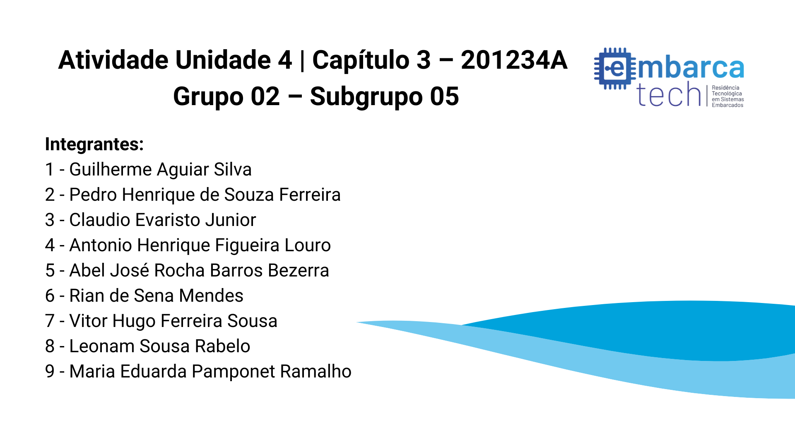

# EmbarcaTechMatrizLED
Projeto em grupo para produção de animações em uma matriz de LED 5x5

# Instruções
Para executar o programa, deve-se possuir a extensão Wokwi Simulator instalada e configurada no Visual Studio Code.

Acesse o arquivo diagram.json, com a extensão Wokwi Simulator instalada, para gerar o ambiente de simulação de uma placa RaspBerry Pi Pico W, juntamente com uma matriz de leds de 5x5, um teclado matricial e um buzzer.

### Todas as teclas do teclado possuem funcões pré-configuradas:

###### Guilherme Aguiar - tecla '1':
 Exibe uma animação de texto escrevendo "YOU WIN" caractere por caractere e uma estrela ao final.
###### Pedro Henrique -  tecla '2':
 Exibe uma animação de texto escrevendo "NEW YEAR" caractere por caractere e uma coração ao final.
###### Claudio Evaristo - tecla '3':
 Exibe a animação representando um Omnitrix descarregando e as cores referentes a cada estado.
###### Antonio Henrique - tecla '4':
 Exibe
###### Abel José - tecla '5':
 Exibe uma animação referente ao jogo "Snake Game" (Jogo da Cobrinha).
###### Rian de Sena - tecla '6':
 Exibe uma animação de explosão gradual de pixels.
###### Vitor Hugo - tecla '7':
 Exibe uma animação de uma caveira roxa se formando na tela, mexendo o queixo e desaparecendo.
###### Leonam Rabelo - tecla '8':
 Exibe uma animação de texto escrevendo "CEPEDI" caractere por caractere e um emoji de sorriso ao final.
###### Maria Eduarda - tecla '9':
 Exibe uma animação de um coração aparecendo na tela, piscando e desaparecendo gradualmente.
###### Função Extra executada pelo Subgrupo - tecla '0':
 Exibe uma animação de texto escrevendo "SUBGRUPO 5" caractere por caractere enquanto o buzzer é ativado durante a animação.
###### tecla 'A':
 Apaga todos os Leds ligados.
###### tecla 'B':
 Liga todos os 25 leds na cor Azul com 100% de intensidade luminosa.
###### tecla 'C':
Liga todos os 25 leds na cor Vermelha com 80% da intensidade luminosa.
###### tecla 'D':
Liga todos os 25 leds na cor Verde com 50% da intensidade luminosa.
###### tecla '#':
Liga todos os 25 leds na cor Branca com 20% da intensidade luminosa.
###### tecla '*':
Ao acionar a tecla '*' faz com que o Raspberry Pi Pico W saia do modo de execução e habilita o modo de gravação via software.

# Vídeo Explicativo

# Contribuições

